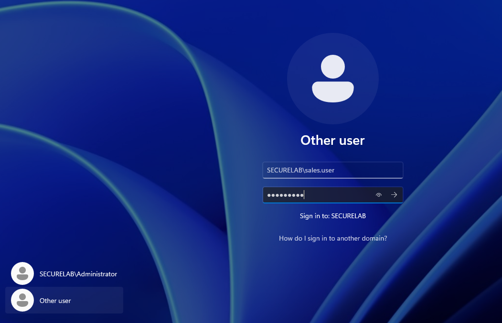
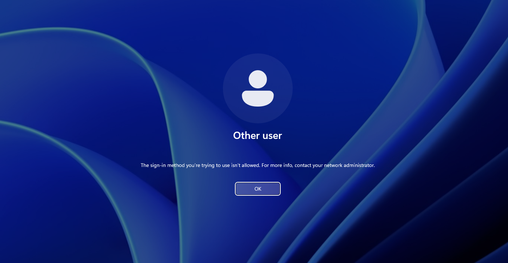
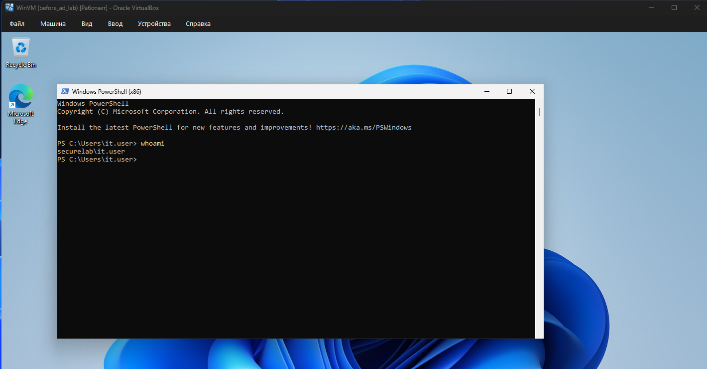
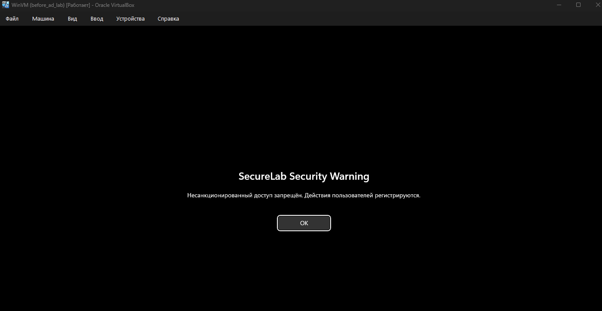
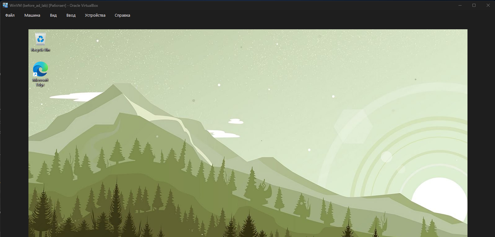

# Active Directory, групповые политики и Linux-клиент

# Задание 1

## Настройка сети

Для связи между виртуальными машинами я создал в VirtualBox внутреннюю сеть `AD-LAB`.

- Windows Server: `192.168.100.10`
- Windows-клиент: `192.168.100.20`
- Debian: `192.168.100.30`

На внутренних интерфейсах шлюз не нужен. DNS-сервером для клиентов стал контроллер домена `192.168.100.10`.

## Установка ролей Windows Server

Windows Server переименовал в `DC01`.

```powershell
PS C:\Users\Administrator> hostname
DC01
PS C:\Users\Administrator> Get-WindowsFeature AD-Domain-Services,DNS,GPMC,FS-FileServer | Format-Table Name,InstallState

Name               InstallState
----               ------------
AD-Domain-Services    Installed
DNS                   Installed
FS-FileServer         Installed
GPMC                  Installed

PS C:\Users\Administrator>
```

После установки ролей создал домен `securelab.test` с NetBIOS-именем `SECURELAB`.

Проверка контроллера домена:

```powershell
PS C:\Users\Administrator> hostname
DC01
PS C:\Users\Administrator> whoami
securelab\administrator

PS C:\Users\Administrator> Get-ADDomain | Select-Object DNSRoot,NetBIOSName,DomainMode,PDCEmulator

DNSRoot        NetBIOSName        DomainMode PDCEmulator
-------        -----------        ---------- -----------
securelab.test SECURELAB   Windows2016Domain DC01.securelab.test

PS C:\Users\Administrator> Get-Service NTDS,DNS | Format-Table Name,Status,StartType

Name Status  StartType
---- ------  ---------
DNS  Running Automatic
NTDS Running Automatic

PS C:\Users\Administrator>
```

Тесты `dcdiag` завершены успешно:

```text
DC01 passed test Connectivity
DC01 passed test Advertising
DC01 passed test DNS
```

## Создание OU и пользователей

Создал три OU:

- `OU=IT`
- `OU=Sales`
- `OU=Workstations`

В `OU=IT` создал пользователя `it.user`, а в `OU=Sales` — `sales.user`.

```powershell
PS C:\Users\Administrator> Get-ADUser -Filter * | Where-Object SamAccountName -in "it.user","sales.user" | Select-Object Name,SamAccountName,UserPrincipalName,Enabled,DistinguishedName

Name              : IT User
SamAccountName    : it.user
UserPrincipalName : it.user@securelab.test
Enabled           : True
DistinguishedName : CN=IT User,OU=IT,DC=securelab,DC=test

Name              : Sales User
SamAccountName    : sales.user
UserPrincipalName : sales.user@securelab.test
Enabled           : True
DistinguishedName : CN=Sales User,OU=Sales,DC=securelab,DC=test

PS C:\Users\Administrator>
```

## Ввод Windows-клиента в домен

Windows-клиент переименовал в `WIN11-CLIENT`, добавил в домен и поместил в `OU=Workstations`.

```powershell
PS C:\Users\Administrator> hostname
WIN11-CLIENT
PS C:\Users\Administrator> whoami
securelab\administrator
PS C:\Users\Administrator> Get-CimInstance Win32_ComputerSystem | Select-Object Name,Domain,PartOfDomain

Name         Domain         PartOfDomain
----         ------         ------------
WIN11-CLIENT securelab.test         True

PS C:\Users\Administrator> Test-ComputerSecureChannel -Verbose
VERBOSE: Performing the operation "Test-ComputerSecureChannel" on target "WIN11-CLIENT".
True
VERBOSE: The secure channel between the local computer and the domain securelab.test is in good condition.
PS C:\Users\Administrator>
```

## Ограничение входа

В локальной политике `WIN11-CLIENT` запретил вход пользователю `sales.user`. Для этого использовал право `SeDenyInteractiveLogonRight`.

```powershell
PS C:\Users\Administrator> Select-String -Path "$env:TEMP\local-security-check.cfg" -Pattern "^SeDenyInteractiveLogonRight"

C:\Users\ADMINI~1\AppData\Local\Temp\local-security-check.cfg:27:SeDenyInteractiveLogonRight =
Guest,*S-1-5-21-779388273-1946493319-2830080781-1104

PS C:\Users\Administrator>
```

Попытка входа `sales.user`:





Вход под `it.user` прошёл успешно:



```powershell
PS C:\Users\it.user> whoami
securelab\it.user
PS C:\Users\it.user> hostname
WIN11-CLIENT
PS C:\Users\it.user> Get-CimInstance Win32_ComputerSystem | Select-Object Name,Domain,PartOfDomain

Name         Domain         PartOfDomain
----         ------         ------------
WIN11-CLIENT securelab.test         True

PS C:\Users\it.user>
```

# Задание 2

## Создание общей папки

На контроллере домена создал общую папку `C:\SecureLab\Shared`.

```powershell
PS C:\Users\Administrator> Get-SmbShare -Name "Shared" | Format-List Name,Path,Description

Name        : Shared
Path        : C:\SecureLab\Shared
Description :

PS C:\Users\Administrator> Get-SmbShareAccess -Name "Shared"

Name   ScopeName AccountName             AccessControlType AccessRight
----   --------- -----------             ----------------- -----------
Shared *         SECURELAB\Domain Admins Allow             Full
Shared *         SECURELAB\Domain Users  Allow             Change

PS C:\Users\Administrator>
```

В эту папку добавил файл `wallpaper.jpg` для обоев.

## Создание GPO

Создал политику `SecureLab Workstation Policy` и привязал её к `OU=Workstations`.

В этой политике настроил:

- единые обои рабочего стола;
- запрет Панели управления;
- отключение командной строки;
- перенаправление папки «Документы»;
- баннер входа с предупреждением;
- loopback processing в режиме `Replace`.

```powershell
PS C:\Users\Administrator> Get-GPO -Name $GpoName | Select-Object DisplayName,GpoStatus,CreationTime,ModificationTime

DisplayName                           GpoStatus CreationTime          ModificationTime
-----------                           --------- ------------          ----------------
SecureLab Workstation Policy AllSettingsEnabled 7/22/2026 12:22:37 PM 7/22/2026 12:24:26 PM

PS C:\Users\Administrator> Get-GPInheritance -Target "OU=Workstations,DC=securelab,DC=test" | Select-Object -ExpandProperty GpoLinks

GpoId       : a3823bcc-aa3a-4074-8e31-bc6a9de92a65
DisplayName : SecureLab Workstation Policy
Enabled     : True
Enforced    : False
Target      : ou=workstations,dc=securelab,dc=test
Order       : 1

PS C:\Users\Administrator>
```

## Проверка GPO на клиенте

```powershell
PS C:\Users\it.user> gpresult /r /scope user

USER SETTINGS
--------------
    CN=IT User,OU=IT,DC=securelab,DC=test
    Group Policy was applied from:      DC01.securelab.test

    Applied Group Policy Objects
    -----------------------------
        SecureLab Workstation Policy

PS C:\Users\it.user>
```

Баннер входа:



Единые обои рабочего стола:



Проверка настроек:

```powershell
PS C:\Users\it.user> Get-ItemProperty "HKCU:\Software\Microsoft\Windows\CurrentVersion\Policies\System" | Select-Object Wallpaper,WallpaperStyle

Wallpaper                   WallpaperStyle
---------                   --------------
\\DC01\Shared\wallpaper.jpg 10

PS C:\Users\it.user> Get-ItemProperty "HKCU:\Software\Microsoft\Windows\CurrentVersion\Policies\Explorer" | Select-Object NoControlPanel

NoControlPanel
--------------
             1

PS C:\Users\it.user> Get-ItemProperty "HKCU:\Software\Policies\Microsoft\Windows\System" | Select-Object DisableCMD

DisableCMD
----------
         1

PS C:\Users\it.user> [Environment]::GetFolderPath("MyDocuments")
\\DC01\Shared\Documents

PS C:\Users\it.user> "Folder redirection works" | Set-Content "$([Environment]::GetFolderPath('MyDocuments'))\gpo_test.txt"
PS C:\Users\it.user> Get-Item "$([Environment]::GetFolderPath('MyDocuments'))\gpo_test.txt" | Select-Object FullName,Length

FullName                             Length
--------                             ------
\\DC01\Shared\Documents\gpo_test.txt     26

PS C:\Users\it.user>
```

# Задание 3

## Настройка сети Debian

На Debian настроил два интерфейса:

- `enp0s3` — NAT;
- `enp0s8` — `AD-LAB`, адрес `192.168.100.30/24`.

```bash
jetjoyred@debian:~$ ip -br address
lo               UNKNOWN        127.0.0.1/8 ::1/128
enp0s3           UP             10.0.2.15/24
enp0s8           UP             192.168.100.30/24

jetjoyred@debian:~$ cat /etc/resolv.conf
# Generated by NetworkManager
nameserver 192.168.100.10
jetjoyred@debian:~$
```

Время Debian синхронизировал с контроллером домена:

```bash
jetjoyred@debian:~$ timedatectl
System clock synchronized: yes
NTP service: active

jetjoyred@debian:~$ timedatectl timesync-status
Server: 192.168.100.10 (192.168.100.10)
jetjoyred@debian:~$
```

## Ввод Debian в домен

Установил `realmd`, `SSSD`, `Kerberos`, `adcli`, Samba и CIFS utilities. После этого добавил Debian в домен `securelab.test`.

```bash
jetjoyred@debian:~$ /usr/sbin/realm list
securelab.test
  type: kerberos
  realm-name: SECURELAB.TEST
  domain-name: securelab.test
  configured: kerberos-member
  server-software: active-directory
  client-software: sssd
  login-formats: %U@securelab.test
  login-policy: allow-realm-logins
jetjoyred@debian:~$ systemctl is-enabled sssd
enabled
jetjoyred@debian:~$ systemctl is-active sssd
active
jetjoyred@debian:~$
```

Проверка доменного пользователя:

```bash
jetjoyred@debian:~$ id 'it.user@securelab.test'
uid=1112601103(it.user@securelab.test) gid=1112600513(domain users@securelab.test) groups=1112600513(domain users@securelab.test)
jetjoyred@debian:~$ getent passwd 'it.user@securelab.test'
it.user@securelab.test:*:1112601103:1112600513:IT User:/home/it.user@securelab.test:/bin/bash
jetjoyred@debian:~$
```

## Автоматическое подключение общей папки

Для автоматического подключения использовал `pam_mount`. В `/etc/security/pam_mount.conf.xml` добавил строку:

```xml
<volume user="it.user@securelab.test" fstype="cifs" server="dc01.securelab.test" path="Shared" mountpoint="~/SecureLabShare" options="vers=3.1.1,sec=ntlmssp,uid=%(USERUID),gid=%(USERGID),file_mode=0600,dir_mode=0700,nosuid,nodev" />
```

После входа доменного пользователя общая папка подключилась автоматически. Повторно вводить пароль не пришлось:

```bash
it.user@securelab.test@debian:~$ whoami
it.user@securelab.test
it.user@securelab.test@debian:~$ echo "$HOME"
/home/it.user@securelab.test
it.user@securelab.test@debian:~$ findmnt -t cifs
TARGET   SOURCE FSTYPE OPTIONS
/home/it.user@securelab.test/SecureLabShare
         //dc01.securelab.test/Shared
                cifs   rw,nosuid,nodev,relatime,vers=3.1.1,sec=ntlmssp
it.user@securelab.test@debian:~$ mountpoint "$HOME/SecureLabShare"
/home/it.user@securelab.test/SecureLabShare is a mountpoint
it.user@securelab.test@debian:~$
```

Проверка записи:

```bash
it.user@securelab.test@debian:~$ printf 'Created from Debian by %s\n' "$(whoami)" > "$HOME/SecureLabShare/debian_test.txt"
it.user@securelab.test@debian:~$ cat "$HOME/SecureLabShare/debian_test.txt"
Created from Debian by it.user@securelab.test
it.user@securelab.test@debian:~$
```

Потом проверил этот файл на контроллере домена:

```powershell
PS C:\Users\Administrator> Get-Item "C:\SecureLab\Shared\debian_test.txt" | Select-Object FullName,Length,LastWriteTime

FullName                            Length LastWriteTime
--------                            ------ -------------
C:\SecureLab\Shared\debian_test.txt     46 7/22/2026 2:00:14 PM

PS C:\Users\Administrator> Get-Content "C:\SecureLab\Shared\debian_test.txt"
Created from Debian by it.user@securelab.test
PS C:\Users\Administrator>
```

# Вывод

Я развернул контроллер домена `securelab.test`, создал OU и двух пользователей. Windows-клиент добавил в домен. Пользователю `sales.user` запретил вход на клиент, а `it.user` смог войти без ошибок.

Также создал GPO с обоями, запретом Панели управления и CMD, перенаправлением папки «Документы» и баннером входа. Все настройки применились на клиенте.

Debian добавил в домен через realmd и SSSD. При входе доменного пользователя общая папка подключается автоматически и не спрашивает пароль ещё раз. Чтение и запись файлов работают.
