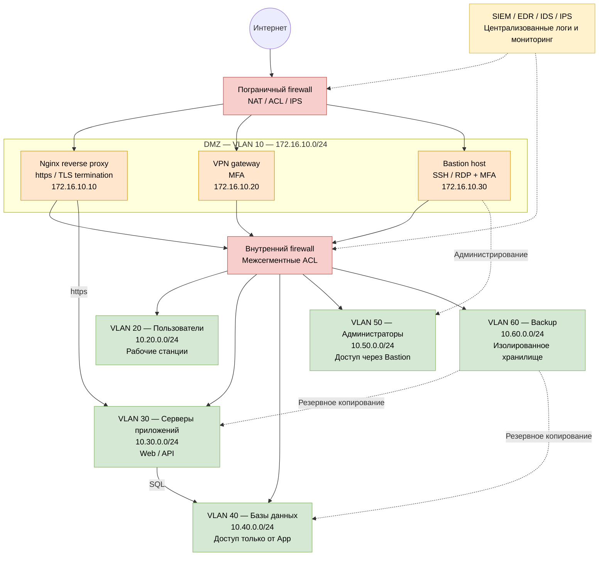

# Инфраструктура компании и Nginx reverse proxy

# Задание 1

## Компания SecureCloud

Для задания я придумал компанию SecureCloud, которая предоставляет SaaS-сервис.

В инфраструктуре используются:

- DMZ;
- firewall;
- Nginx reverse proxy;
- VPN gateway;
- bastion host;
- серверы приложений;
- серверы баз данных;
- сервер резервного копирования;
- разделение сети на VLAN;
- централизованный сбор логов и мониторинг.

Схема инфраструктуры:



Редактируемый исходник схемы: [company_infrastructure.drawio](./infrastructure_homework/company_infrastructure.drawio)

В DMZ находятся reverse proxy, VPN gateway и bastion host.

Внутреннюю сеть я разделил на VLAN пользователей, серверов приложений, баз данных, администраторов и резервного копирования.

Трафик https сначала проходит через firewall, а затем попадает на reverse proxy. К базам данных могут обращаться только серверы приложений. Для администрирования используются VPN и bastion host.

# Задание 2

## Окружение

- Debian GNU/Linux 13 (trixie)
- hostname: debian
- IP-адрес: 10.0.2.15
- локальный web-сервис: 127.0.0.1:8080
- reverse proxy: Nginx

## Установка пакетов

```bash
jetjoyred@debian:~$ sudo apt update
jetjoyred@debian:~$ sudo apt install -y nginx curl python3
jetjoyred@debian:~$
```

## Локальный web-сервис

Создал локальный web-сервис в файле `/opt/homework-web/backend.py`:

```python
from http.server import BaseHTTPRequestHandler, HTTPServer
from datetime import datetime

class Handler(BaseHTTPRequestHandler):
    def do_GET(self):
        body = f"""<!DOCTYPE html>
<html lang="ru">
<head>
    <meta charset="UTF-8">
    <title>SecureCloud</title>
</head>
<body>
    <h1>SecureCloud local web service</h1>
    <p>Запрос успешно прошёл через Nginx Reverse Proxy.</p>
    <p>Backend: 127.0.0.1:8080</p>
    <p>Time: {datetime.now().isoformat()}</p>
</body>
</html>
""".encode("utf-8")

        self.send_response(200)
        self.send_header("Content-Type", "text/html; charset=utf-8")
        self.send_header("Content-Length", str(len(body)))
        self.send_header("X-Backend-Server", "python-http")
        self.end_headers()
        self.wfile.write(body)

    def log_message(self, format, *args):
        print(f"{self.client_address[0]} - {format % args}", flush=True)

HTTPServer(("127.0.0.1", 8080), Handler).serve_forever()
```

Чтобы backend запускался автоматически, создал службу `/etc/systemd/system/securecloud-backend.service`:

```ini
[Unit]
Description=SecureCloud local web service
After=network.target

[Service]
Type=simple
User=www-data
Group=www-data
WorkingDirectory=/opt/homework-web
ExecStart=/usr/bin/python3 /opt/homework-web/backend.py
Restart=on-failure
NoNewPrivileges=true
PrivateTmp=true
ProtectSystem=strict
ProtectHome=true

[Install]
WantedBy=multi-user.target
```

Запуск службы:

```bash
jetjoyred@debian:~$ sudo systemctl daemon-reload
jetjoyred@debian:~$ sudo systemctl enable --now securecloud-backend.service
jetjoyred@debian:~$
```

Проверка:

```bash
jetjoyred@debian:~$ systemctl is-enabled securecloud-backend
enabled
jetjoyred@debian:~$ systemctl is-active securecloud-backend
active
jetjoyred@debian:~$ sudo ss -tlnp | grep ':8080'
LISTEN 0      5          127.0.0.1:8080      0.0.0.0:*    users:(("python3",pid=4285,fd=3))
jetjoyred@debian:~$ curl -i http://127.0.0.1:8080/
HTTP/1.0 200 OK
Server: BaseHTTP/0.6 Python/3.13.5
Date: Wed, 22 Jul 2026 16:39:16 GMT
Content-Type: text/html; charset=utf-8
Content-Length: 335
X-Backend-Server: python-http

<!DOCTYPE html>
<html lang="ru">
<head>
    <meta charset="UTF-8">
    <title>SecureCloud</title>
</head>
<body>
    <h1>SecureCloud local web service</h1>
    <p>Запрос успешно прошёл через Nginx Reverse Proxy.</p>
    <p>Backend: 127.0.0.1:8080</p>
    <p>Time: 2026-07-22T19:39:16.121507</p>
</body>
</html>
jetjoyred@debian:~$
```

Backend работает и слушает только локальный адрес `127.0.0.1:8080`.

## Самоподписанный сертификат

```bash
jetjoyred@debian:~$ sudo mkdir -p /etc/nginx/ssl
jetjoyred@debian:~$ sudo openssl req -x509 -nodes -newkey rsa:2048 -sha256 -days 365 -keyout /etc/nginx/ssl/securecloud.key -out /etc/nginx/ssl/securecloud.crt -subj "/C=RU/ST=Moscow/L=Moscow/O=SecureCloud/OU=IT/CN=securecloud.local" -addext "subjectAltName=DNS:securecloud.local,DNS:debian,DNS:localhost,IP:10.0.2.15,IP:127.0.0.1"
jetjoyred@debian:~$ sudo chmod 600 /etc/nginx/ssl/securecloud.key
jetjoyred@debian:~$ sudo chmod 644 /etc/nginx/ssl/securecloud.crt
jetjoyred@debian:~$
```

## Настройка Nginx reverse proxy

Настройки reverse proxy записал в `/etc/nginx/sites-available/securecloud`:

```nginx
server {
    listen 80;
    listen [::]:80;
    server_name securecloud.local debian localhost 10.0.2.15;

    return 301 https://$host$request_uri;
}

server {
    listen 443 ssl;
    listen [::]:443 ssl;
    server_name securecloud.local debian localhost 10.0.2.15;

    ssl_certificate     /etc/nginx/ssl/securecloud.crt;
    ssl_certificate_key /etc/nginx/ssl/securecloud.key;
    ssl_protocols TLSv1.2 TLSv1.3;

    add_header Strict-Transport-Security "max-age=31536000; includeSubDomains" always;
    add_header X-Content-Type-Options "nosniff" always;
    add_header X-Frame-Options "SAMEORIGIN" always;

    location / {
        proxy_pass http://127.0.0.1:8080;
        proxy_http_version 1.1;

        proxy_set_header Host $host;
        proxy_set_header X-Real-IP $remote_addr;
        proxy_set_header X-Forwarded-For $proxy_add_x_forwarded_for;
        proxy_set_header X-Forwarded-Proto $scheme;

        proxy_connect_timeout 5s;
        proxy_read_timeout 30s;
    }
}
```

Включение конфигурации:

```bash
jetjoyred@debian:~$ sudo rm -f /etc/nginx/sites-enabled/default
jetjoyred@debian:~$ sudo ln -s /etc/nginx/sites-available/securecloud /etc/nginx/sites-enabled/securecloud
jetjoyred@debian:~$ sudo systemctl reload nginx
jetjoyred@debian:~$
```

Проверка конфигурации:

```bash
jetjoyred@debian:~$ sudo /usr/sbin/nginx -t
nginx: the configuration file /etc/nginx/nginx.conf syntax is ok
nginx: configuration file /etc/nginx/nginx.conf test is successful
jetjoyred@debian:~$
```

## Проверка http и https

Проверка перенаправления с http на https:

```bash
jetjoyred@debian:~$ curl -I http://127.0.0.1/
HTTP/1.1 301 Moved Permanently
Server: nginx
Date: Wed, 22 Jul 2026 16:40:28 GMT
Content-Type: text/html
Content-Length: 162
Connection: keep-alive
Location: https://127.0.0.1/

jetjoyred@debian:~$
```

Проверка https-трафика через reverse proxy:

```bash
jetjoyred@debian:~$ curl -ki https://127.0.0.1/
HTTP/1.1 200 OK
Server: nginx
Date: Wed, 22 Jul 2026 16:40:28 GMT
Content-Type: text/html; charset=utf-8
Content-Length: 335
Connection: keep-alive
X-Backend-Server: python-http
Strict-Transport-Security: max-age=31536000; includeSubDomains
X-Content-Type-Options: nosniff
X-Frame-Options: SAMEORIGIN

<!DOCTYPE html>
<html lang="ru">
<head>
    <meta charset="UTF-8">
    <title>SecureCloud</title>
</head>
<body>
    <h1>SecureCloud local web service</h1>
    <p>Запрос успешно прошёл через Nginx Reverse Proxy.</p>
    <p>Backend: 127.0.0.1:8080</p>
    <p>Time: 2026-07-22T19:40:28.638101</p>
</body>
</html>
jetjoyred@debian:~$
```

Nginx вернул `200 OK`. Заголовок `X-Backend-Server` показывает, что ответ пришёл от локального web-сервиса. Заголовок `Strict-Transport-Security` показывает, что HSTS включён.

## Проверка сертификата

```bash
jetjoyred@debian:~$ openssl x509 -in /etc/nginx/ssl/securecloud.crt -noout -subject -issuer -dates -ext subjectAltName
subject=C=RU, ST=Moscow, L=Moscow, O=SecureCloud, OU=IT, CN=securecloud.local
issuer=C=RU, ST=Moscow, L=Moscow, O=SecureCloud, OU=IT, CN=securecloud.local
notBefore=Jul 22 16:39:53 2026 GMT
notAfter=Jul 22 16:39:53 2027 GMT
X509v3 Subject Alternative Name:
    DNS:securecloud.local, DNS:debian, DNS:localhost, IP Address:10.0.2.15, IP Address:127.0.0.1
jetjoyred@debian:~$
```

Поля `subject` и `issuer` совпадают. Значит, сертификат самоподписанный.

# Вывод

Я подготовил схему SaaS-компании с DMZ, firewall, VPN, VLAN, bastion host, серверами и резервным копированием.

На Debian я запустил локальный web-сервис и настроил Nginx reverse proxy. Также добавил самоподписанный сертификат, перенаправление с http на https и HSTS. Проверка показала, что трафик https проходит через Nginx к локальному web-сервису.
