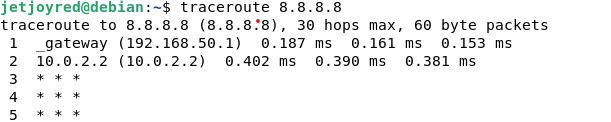
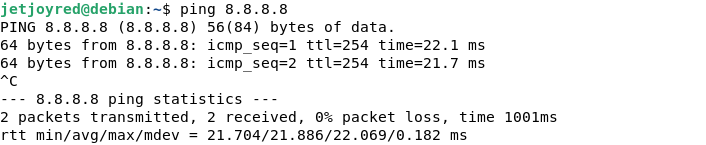
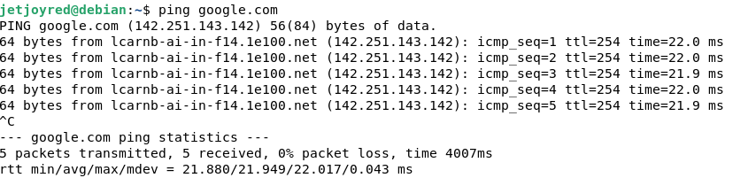
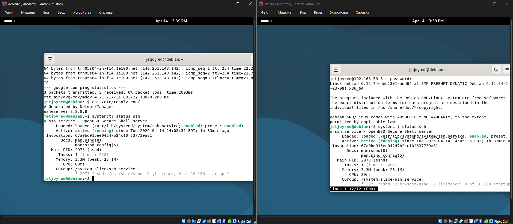
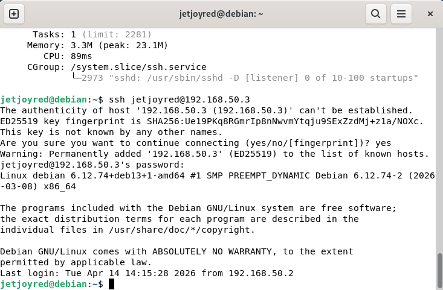
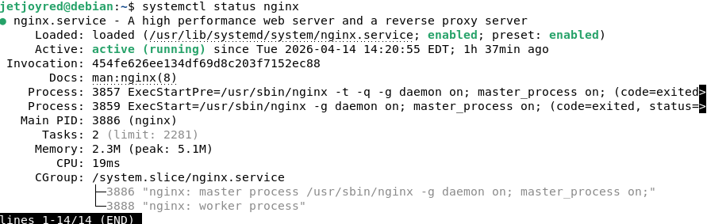

# Задание 1

## Команда ip a

### Команда используется для просмотра сетевых интерфейсов и их ip.
### В результате отображаются активные интерфейсы и назначенные им адреса.
```
┌──(jetjoyred㉿kali)-[~]
└─$ ip a 
1: lo: <LOOPBACK,UP,LOWER_UP> mtu 65536 qdisc noqueue state UNKNOWN group default qlen 1000
    link/loopback 00:00:00:00:00:00 brd 00:00:00:00:00:00
    inet 127.0.0.1/8 scope host lo
       valid_lft forever preferred_lft forever
    inet6 ::1/128 scope host noprefixroute 
       valid_lft forever preferred_lft forever
2: eth0: <BROADCAST,MULTICAST,UP,LOWER_UP> mtu 1500 qdisc fq_codel state UP group default qlen 1000
    link/ether 08:00:27:c7:36:2d brd ff:ff:ff:ff:ff:ff
    inet 10.0.2.15/24 brd 10.0.2.255 scope global dynamic noprefixroute eth0
       valid_lft 85719sec preferred_lft 85719sec
    inet6 fd17:625c:f037:2:729d:273e:f1c:2d5/64 scope global temporary dynamic 
       valid_lft 86047sec preferred_lft 14047sec
    inet6 fd17:625c:f037:2:a00:27ff:fec7:362d/64 scope global dynamic mngtmpaddr noprefixroute 
       valid_lft 86047sec preferred_lft 14047sec
    inet6 fe80::a00:27ff:fec7:362d/64 scope link noprefixroute 
       valid_lft forever preferred_lft forever
3: eth1: <BROADCAST,MULTICAST,UP,LOWER_UP> mtu 1500 qdisc fq_codel state UP group default qlen 1000
    link/ether 08:00:27:4f:de:97 brd ff:ff:ff:ff:ff:ff
```
## Команда ping
### Команда проверяет доступность удаленного узла.
### Успешный ответ означает наличие сетевого соединения
```
┌──(jetjoyred㉿kali)-[~]
└─$ ping -c 4 8.8.8.8  
PING 8.8.8.8 (8.8.8.8) 56(84) bytes of data.
64 bytes from 8.8.8.8: icmp_seq=1 ttl=255 time=0.498 ms
64 bytes from 8.8.8.8: icmp_seq=2 ttl=255 time=0.496 ms
64 bytes from 8.8.8.8: icmp_seq=3 ttl=255 time=0.435 ms
64 bytes from 8.8.8.8: icmp_seq=4 ttl=255 time=0.488 ms

--- 8.8.8.8 ping statistics ---
4 packets transmitted, 4 received, 0% packet loss, time 3054ms
rtt min/avg/max/mdev = 0.435/0.479/0.498/0.025 ms
```
## Команда traceroute 
### Команда показывает маршрут прохождения пакетов до узла
### Позволяет определить промежуточные узлы сети
```
┌──(jetjoyred㉿kali)-[~]
└─$ traceroute 8.8.8.8
traceroute to 8.8.8.8 (8.8.8.8), 30 hops max, 60 byte packets
 1  10.0.2.2 (10.0.2.2)  0.417 ms  0.399 ms  0.392 ms
 2  * * *
 3  * * *
 4  * * *
```
## Команда SS/NETSTAT
### Команда показывает активные сетевые соединения и открытые порты
```
┌──(jetjoyred㉿kali)-[~]
└─$ ss -tuln
Netid       State       Recv-Q       Send-Q             Local Address:Port             Peer Address:Port      
```
## Команда DIG
### Команда используется для проверки DNS записей
### Показывает ip адреса домена и DNS серверы
```
┌──(jetjoyred㉿kali)-[~]
└─$ dig google.com 

; <<>> DiG 9.20.20-1-Debian <<>> google.com
;; global options: +cmd
;; Got answer:
;; ->>HEADER<<- opcode: QUERY, status: NOERROR, id: 27403
;; flags: qr rd ra; QUERY: 1, ANSWER: 1, AUTHORITY: 0, ADDITIONAL: 1

;; OPT PSEUDOSECTION:
; EDNS: version: 0, flags:; MBZ: 0x00e6, udp: 1232
;; QUESTION SECTION:
;google.com.                    IN      A

;; ANSWER SECTION:
google.com.             230     IN      A       172.217.17.206

;; Query time: 51 msec
;; SERVER: 172.18.0.2#53(172.18.0.2) (UDP)
;; WHEN: Sun Apr 12 15:10:06 EDT 2026
;; MSG SIZE  rcvd: 65
```
# Задание 2
## Настройка NAT и проверка сети
### Схема сети
Kali->Debian1->Debian2
Kali - внешний интернет
Debian1 - маршрутизатор
Debian2 - клиент

### Настройка NAT
### Включение маршрутизация (Debian1)

```
sysctl -w net.ipv4.ip_forward=1
┌──(jetjoyred㉿kali)-[~]
└─$ sudo iptables -t nat -A POSTROUTING -o eth0 -j MASQUERADE
                                                                                                              
┌──(jetjoyred㉿kali)-[~]
└─$ sudo iptables -A FORWARD -i eth1 -o eth0 -j ACCEPT       
                                                                                                              
┌──(jetjoyred㉿kali)-[~]
└─$ sudo iptables -A FORWARD -i eth1 -o eth1 -m state --state RELATED,ESTABLISHED -j ACCEPT 
```
### Команды ping и traceroute с Debian2


### Успешное разрешение доменных имен и содержимое файла /etc/resolv.conf

                                                                                                              

# Задание 3
## Настройка ssh доступа

### Подключение по ssh к Deb1

```
┌──(jetjoyred㉿kali)-[~]
└─$ ssh jetjoyred@192.168.50.2                          
jetjoyred@192.168.50.2's password: 
Linux debian 6.12.74+deb13+1-amd64 #1 SMP PREEMPT_DYNAMIC Debian 6.12.74-2 (2026-03-08) x86_64

The programs included with the Debian GNU/Linux system are free software;
the exact distribution terms for each program are described in the
individual files in /usr/share/doc/*/copyright.

Debian GNU/Linux comes with ABSOLUTELY NO WARRANTY, to the extent
permitted by applicable law.
Last login: Tue Apr 14 14:08:04 2026 from 192.168.50.1
jetjoyred@debian:~$ 
```



# Задание 4
### Описание
В рамках задания был настроен доступ к Deb2 через промежуточный узел Deb1 с использованием механизма jump-host
### Схема подключения
Kali->Debian1->Debian2
### Подключение через jumphost
```
etjoyred@debian:~$ ssh -J jetjoyred@192.168.50.2 jetjoyred@192.168.50.3
The authenticity of host '192.168.50.2 (192.168.50.2)' can't be established.
ED25519 key fingerprint is SHA256:D3yFjnbJKx10j/jr88xv3CQcaQ8V+6d2znXFrE+Eb1g.
This key is not known by any other names.
Are you sure you want to continue connecting (yes/no/[fingerprint])? yes
Warning: Permanently added '192.168.50.2' (ED25519) to the list of known hosts.
jetjoyred@192.168.50.2's password: 
jetjoyred@192.168.50.3's password: 
Linux debian 6.12.74+deb13+1-amd64 #1 SMP PREEMPT_DYNAMIC Debian 6.12.74-2 (2026-03-08) x86_64

The programs included with the Debian GNU/Linux system are free software;
the exact distribution terms for each program are described in the
individual files in /usr/share/doc/*/copyright.

Debian GNU/Linux comes with ABSOLUTELY NO WARRANTY, to the extent
permitted by applicable law.
Last login: Tue Apr 14 15:43:50 2026 from 192.168.50.3
jetjoyred@debian:~$ 

jetjoyred@debian:~$ ip a
1: lo: <LOOPBACK,UP,LOWER_UP> mtu 65536 qdisc noqueue state UNKNOWN group default qlen 1000
    link/loopback 00:00:00:00:00:00 brd 00:00:00:00:00:00
    inet 127.0.0.1/8 scope host lo
       valid_lft forever preferred_lft forever
    inet6 ::1/128 scope host noprefixroute 
       valid_lft forever preferred_lft forever
2: enp0s3: <BROADCAST,MULTICAST,UP,LOWER_UP> mtu 1500 qdisc fq_codel state UP group default qlen 1000
    link/ether 08:00:27:74:be:8c brd ff:ff:ff:ff:ff:ff
    altname enx08002774be8c
    inet 192.168.50.3/24 brd 192.168.50.255 scope global enp0s3
       valid_lft forever preferred_lft forever
    inet6 fe80::a00:27ff:fe74:be8c/64 scope link proto kernel_ll 
       valid_lft forever preferred_lft forever

```


# Задание 5
### Nginx установлен на Deb2

### Доступность с Kali
```
┌──(jetjoyred㉿kali)-[~]
└─$ curl 192.168.50.3
<!DOCTYPE html>
<html>
<head>
<title>Welcome to nginx!</title>
<style>
html { color-scheme: light dark; }
body { width: 35em; margin: 0 auto;
font-family: Tahoma, Verdana, Arial, sans-serif; }
</style>
</head>
<body>
<h1>Welcome to nginx!</h1>
<p>If you see this page, the nginx web server is successfully installed and
working. Further configuration is required.</p>

<p>For online documentation and support please refer to
<a href="http://nginx.org/">nginx.org</a>.<br/>
Commercial support is available at
<a href="http://nginx.com/">nginx.com</a>.</p>

<p><em>Thank you for using nginx.</em></p>
</body>
</html>
```
